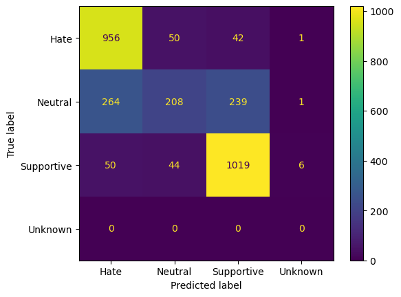

# Hate speech detection with LLMs

This repository contains the code for LLM fine-tuning to detect hate speech in tweets. The code is based heavily on HuggingFace ecosystem. Moreover, I used `unsloth` library, which simplifies the process of fine-tuning and using 4-bit LLMs. For the fine-tuning process, I used the Measuring Hate Speech dataset available [here](https://huggingface.co/datasets/ucberkeley-dlab/measuring-hate-speech). The dataset contains 136k rows of data, each row containing a tweet and a wide range of continuous labels. For this task, continuos labels are converted into 3 classes: Hate/Neutral/Supportive speech.
The prompt used for fine-tuning is:
```
[INST] ### Instruction: Below is a short text that you need to classify into one of three classes: Hate / Neutral / Supportive.\n ### Text: {{ .Prompt }}\n ### Answer: [/INST]
```

## Requirements

Create a new conda environment by running `conda env create -f environment.yml`. The environment contains all the necessary packages to run the code.

## Fine-tuning

To fine-tune a model, run `python -m train`. The script will download the dataset, pre-trained model, fine-tune the model and save the model to `results` directory. Default arguments will reproduce the results from the accompanying Jupyter notebook and the plot below.

## Results

```
              precision    recall  f1-score   support

        Hate       0.75      0.91      0.82      1049
     Neutral       0.69      0.29      0.41       712
  Supportive       0.78      0.91      0.84      1119
     Unknown       0.00      0.00      0.00         0

    accuracy                           0.76      2880
   macro avg       0.56      0.53      0.52      2880
weighted avg       0.75      0.76      0.73      2880
```



According to the metrics the model struggles with differentiating Hate/Supportive speech and Neutral speech. This is most likely due to the fact that the boundaries between the classes are poorly defined, even according to the dataset authors.

None the less, fine-tuning the model has clearly improved it's performance compared to zero-shot classification:
```
              precision    recall  f1-score   support

        Hate       0.50      0.78      0.61      1049
     Neutral       0.20      0.07      0.10       712
  Supportive       0.83      0.22      0.35      1119
     Unknown       0.00      0.00      0.00         0

    accuracy                           0.39      2880
   macro avg       0.38      0.27      0.26      2880
weighted avg       0.55      0.39      0.38      2880
```

## Inference

This repo also implements a simple inference endpoint running with Flask and Ollama. Ollama is used for model serving, while Flask app provides an API a reporting feature by keeping a datebase with inference requests.  
To install Ollama follow the instructions [here](https://github.com/ollama/ollama). and then run `./bootstrap.sh` to start both model server and Flask app. The app will be available at `localhost:5000`. The app provides two endpoints: `/healthcheck` and `/infer`. The first one is used to check if the model server is running, while the second one is used to make inference requests.
